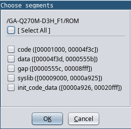
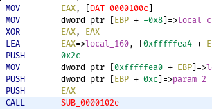

# Ghidra scripts

<!-- markdown-toc start - Don't edit this section. Run M-x markdown-toc-refresh-toc -->
**Table of Contents**

- [Ghidra scripts](#ghidra-scripts)
    - [Installing scripts](#installing-scripts)
    - [External references search](#external-references-search)
        - [Instruction](#instruction)
    - [Set entry points in selection](#set-entry-points-in-selection)
        - [Instruction](#instruction-1)
    - [Remove all references](#remove-all-references)
        - [From address](#from-address)
        - [To address](#to-address)
        - [Instruction](#instruction-2)
    - [FindMultipleLabels](#findmultiplelabels)
    - [FindNeededFunctions](#findneededfunctions)

<!-- markdown-toc end -->

## Installing scripts

Please read `${GHIDRA_HOME}/docs/GhidraClass/Intermediate/Scripting_withNotes.html` and *Ghidra Script Manager* section of Help.

## External references search

| :information_source: | [Source file](./FindExternalReferences.java) |
| -----                | -----                                        |

Script finds all references to the functions and data from all external programs (shared libraries), then creates additional memory blocks and transfer all info about functions (name, signature, additional info) and data (name, also create comment with value and annotation with link to external program).

### Instruction

1. Import binary file.
2. Analyze it.
3. Add needed external programs (see Figure 1):
    - `Window → External Programs`
    - `Add External Program Name`
    - `Set External Name Association`

    
    > Figure 1. Added External Programs
    
4. Run the script (choose memory blocks if needed, see Figure 2).

    
    > Figure 2. Choose needed memory blocks

| Before                         | After                        |
| -----                          | -----                        |
|  |  |
> Figure 3. Before and after running the script

| :information_source: | You can run the script multiple times. |
| -----                | -----                                  |

:warning: **Warning:**

>>>

- script will not change user-defined symbols (you should delete user-defined symbols, if you want to import information from external symbols);

- you should look symbols with `Global` namespace (not external) for finding xrefs to external functions and data (see Figure 4).

>>>

> Figure 4. Symbol with `Global` Namespace have true references

## Set entry points in selection

| :information_source: | [Source file](./SetEntryPointsInSelection.java) |
| -----                | -----                                           |

Script set all labels (functions) in selection as Entry Point.

### Instruction

1. Select needed functions through Functions window.
2. Run the script.

## Remove all references

Use for clearing of the analysis results.

### From address

| :information_source: | [Source file](./RemoveAllReferencesFromAddress.java) |
| -----                | -----                                                |

### To address

| :information_source: | [Source file](./RemoveAllReferencesToAddress.java) |
| -----                | -----                                              |

### Instruction

1. Select addresses or set the cursor to one address.
2. Run the script.

## FindMultipleLabels

Print all symbols (and their addresses) with multiple labels. Maybe useful for Version Tracking session.

| :information_source: | [Source file](./FindMultipleLabels.java) |
| -----                | -----                                    |

## FindNeededFunctions

| :information_source: | [Source file](./FindNeededFunctions.java) |
| -----                | -----                                    |

Find all functions with parameters, which will be dereferenced.

### Instruction

1. Run the script.
